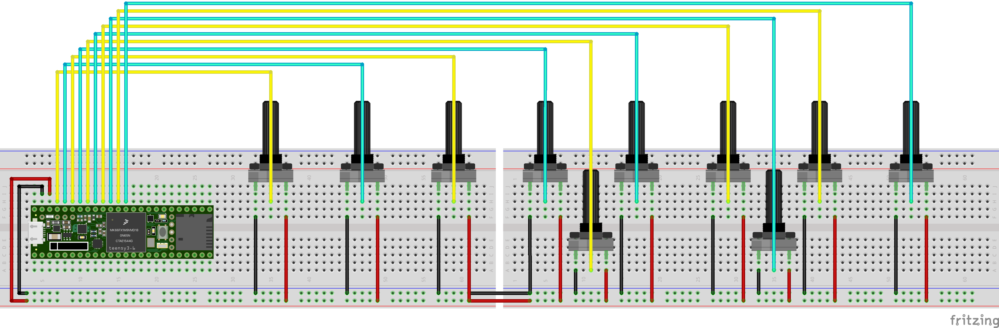

# MIDI Controller Project with Teensy 3.6

This project is designed to work with the Teensy 3.6 microcontroller. The code allows the Teensy to function as a MIDI controller, interfacing with various audio/video software and hardware.

## Teensy 3.6 MIDI Controller

The `midicontroller.ino` file contains the necessary code to convert analog signals from potentiometers into MIDI signals that can be used to control music software or MIDI-compatible hardware.

### Connection Diagram

This diagram illustrates how to connect 10 potentiometers of 50 kOhm to the Teensy 3.6 to create a custom MIDI controller.

### How to Use

1. Ensure you have a Teensy 3.6 microcontroller.
2. Follow the connection diagram to connect the 10 potentiometers to the Teensy.
3. Upload the `midicontroller.ino` code to the Teensy using the Arduino IDE or Teensyduino.
4. Once uploaded, the Teensy will send MIDI signals based on the positions of the potentiometers.
5. Map these MIDI signals to control parameters in your chosen software or hardware.

### Requirements

- Teensy 3.6 microcontroller
- 10 potentiometers (50 kOhm)
- Wires and soldering equipment
- Arduino IDE or Teensyduino

### Developer

Santiago Torres - [@ethx42](https://github.com/ethx42)

### Contributing

If you would like to contribute to this project or suggest improvements, please feel free to submit a pull request or open an issue on the project repository.

### License

This project is open-source and is available under the MIT License. See the LICENSE file for more details.

